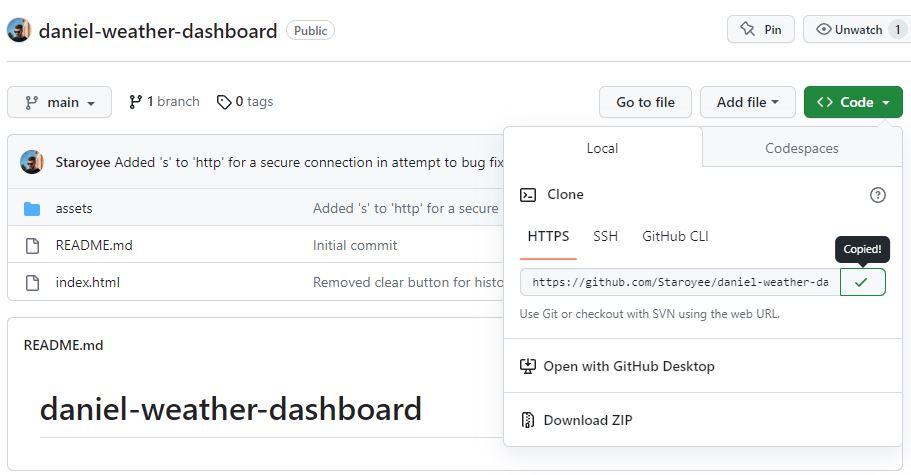
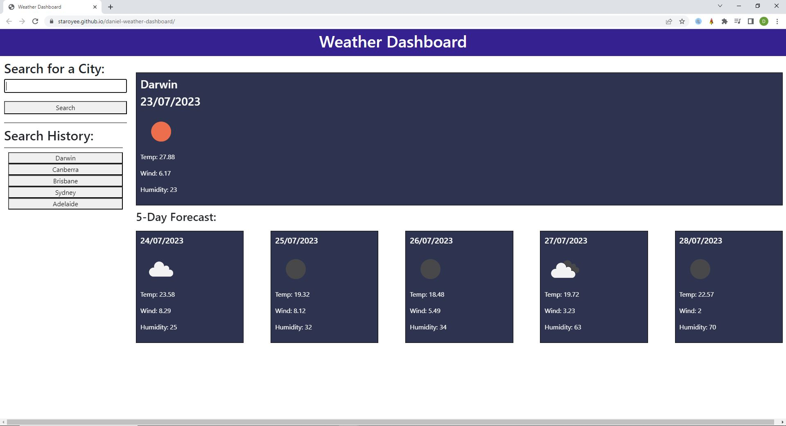

# daniel-weather-dashboard

## Description
I was tasked to create a webpage that would take user input and display the current weather and 5 day weather forecast, whilst keeping a record of the search history.

I was motivated to undertake this task because I wished to gain a greater understanding of how to use JavaScript to call upon server-side API's, collect their available data, and display it on my webpage.

## Solve
The completion of this project provides the user with a functional weather app which they can enter the names of cities and be returned with a display of the current weather and 5 day weather forecast of that cities location. It also records search history and allows the user to click on each previous search to re-display the weather for that city.

The webpage is now deployed for use.

## I have learned:
* How to use JavaScript to call upon server-side-APIs.
* How to use JavaScript to access the data within the APIs.
* How to use JavaScript to display the data on my webpage.

## Installation
Steps to install this project on your local PC
1. Open the termal on your machine.
2. Use the terminal command `cd` to navigate to the directory where we want the repository located.
3. Locate the 'Code' button on the 'Daniel-weather-dashboard' github repository, click it, then copy the 'HTTPS' link to clipboard. (See image)

4. Use the git command `git clone` followed by the URL copied from Github to clone the repo to our machine.
5. The `git clone` command creates a new directory with the same name as the repository. We navigate into our new directory using `cd`.
6. The repository should now be cloned onto your device and able to be edited in VScode or another editing software.

## Instructions

To use the site:
1. Enter the name of a city and press 'search'
2. View the current weather and 5 day weather forecast
3. Click on the city named buttons in the search history to re-display that city's weather

## Deployed Application Link
* https://staroyee.github.io/daniel-weather-dashboard/

## Screenshot

## Credits
* https://stackoverflow.com/questions/67765238/mixed-content-the-page-at-was-loaded-over-https-but-requested-an-insecure-resour
* https://openweathermap.org/forecast5#geo5
* https://developer.mozilla.org/en-US/docs/Web/API/Element/setAttribute
* https://getbootstrap.com/docs/5.1/getting-started/introduction/
* https://openweathermap.org/current
* https://openweathermap.org/api
* https://openweathermap.org/weather-conditions
* https://www.javascripttutorial.net/javascript-fetch-api/
* https://www.geeksforgeeks.org/how-to-use-the-javascript-fetch-api-to-get-data/
